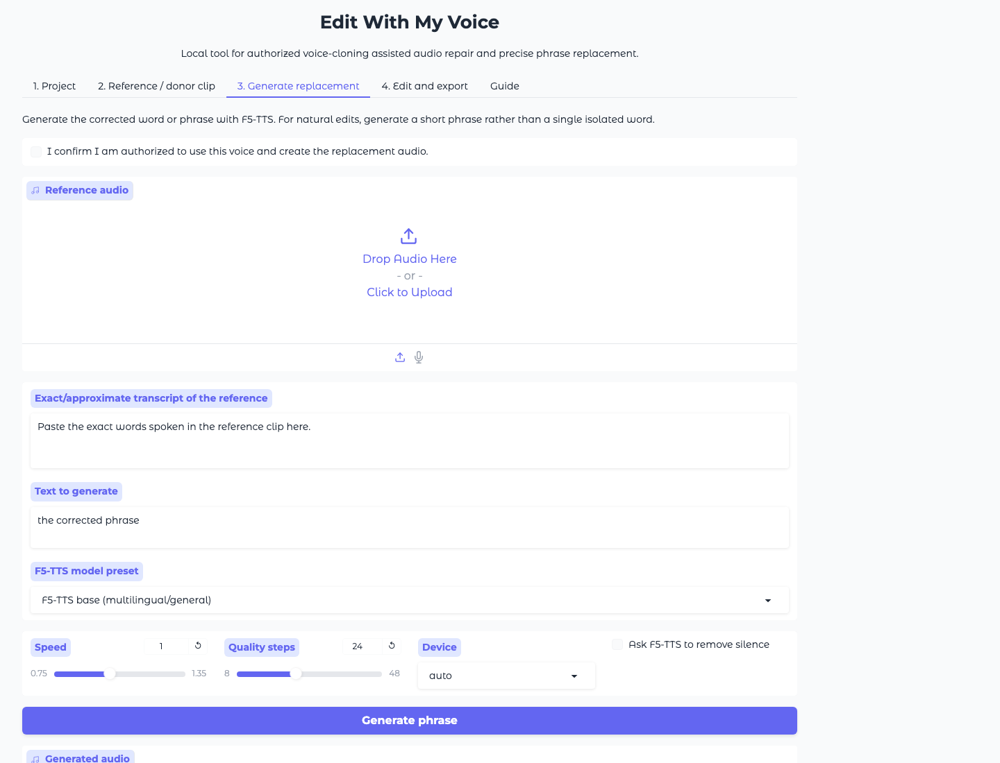

# Edit With My Voice



A local, browser-based tool for repairing spoken audio with voice-cloning assisted generation and precise audio splicing.

The goal is not to create a generic deepfake toy: it is a practical editor for replacing a wrong word or a short phrase in lectures, voiceovers, podcasts, and training material **when you have authorization to use the voice**.

## What it does

- Loads audio/video and prepares a clean 48 kHz mono working WAV.
- Extracts reference clips from the original voice.
- Generates replacement speech locally with F5-TTS.
- Lets you define one or more timestamped edits.
- Applies replacements with time-fitting, RMS loudness matching, and crossfades.
- Exports a corrected WAV/M4A plus a before/after preview montage.

## Quick start on Windows

### 1. Install prerequisites

- **Python 3.11** from <https://www.python.org/downloads/windows/>
  During install, enable **Add python.exe to PATH**.
- **FFmpeg**. The setup script tries to install it with `winget`; if that fails, install it from <https://www.gyan.dev/ffmpeg/builds/> and restart the terminal.

### 2. Run the one-click launcher

Download or clone this repository, then double-click:

```text
run_windows.bat
```

The first launch can take several minutes because it creates a virtual environment and installs AI/audio dependencies.
When the browser opens, use:

```text
http://127.0.0.1:7860
```

## macOS / Linux

```bash
git clone https://github.com/Zer0codestuff/EditWithMyVoice.git
cd EditWithMyVoice
./scripts/setup_unix.sh
./scripts/run_unix.sh
```

## Recommended workflow

1. **Project**: upload the original audio/video and click **Prepare source**.
2. **Reference / donor clip**: extract 10–30 seconds of clean voice from the same speaker.
3. **Generate phrase**: choose a model, paste the reference transcript, and generate the corrected phrase.
4. **Edit list**: set start/end timestamps for the word or phrase to replace.
5. **Apply**: export the corrected file and listen to the before/after preview.

For best results, generate a short phrase such as `the Lightning Network`, not a single isolated word. Speech sounds natural because of surrounding context, timing, breaths, and room tone.

## Privacy and consent

- Use this only with the speaker's consent or with content you are authorized to edit.
- Everything runs locally except model downloads from Hugging Face during first use.
- The app does not upload your media to a hosted service.
- Generated files and uploaded media stay inside `workspace/`, which is ignored by Git.

## Model notes

The app includes these presets:

- **F5-TTS base**: general default from the `f5-tts` package.
- **Italian F5-TTS**: optional preset using `alien79/F5-TTS-italian` from Hugging Face; useful for Italian-only audio.

Model licenses may differ from this repository's code license. Check the model card before commercial use.

## Troubleshooting

### `ffmpeg was not found`

Install FFmpeg and restart the terminal. On Windows, try:

```powershell
winget install --id Gyan.FFmpeg -e
```

### F5-TTS is slow on CPU

CPU generation works but can be slow. On NVIDIA Windows machines, install the CUDA-enabled PyTorch build in the virtual environment, then choose `cuda` in the UI.

### The generated phrase sounds pasted in

- Use 20–40 ms crossfade.
- Generate a phrase, not just a word.
- Match the replacement to the same emotion and pace.
- Try a real donor clip from elsewhere in the same recording before using AI.

## Development

```bash
python -m venv .venv
source .venv/bin/activate  # Windows: .venv\Scripts\activate
python -m pip install -e .[dev]
pytest
ruff check .
```

## License

MIT for the application code. Third-party models and dependencies keep their own licenses.
